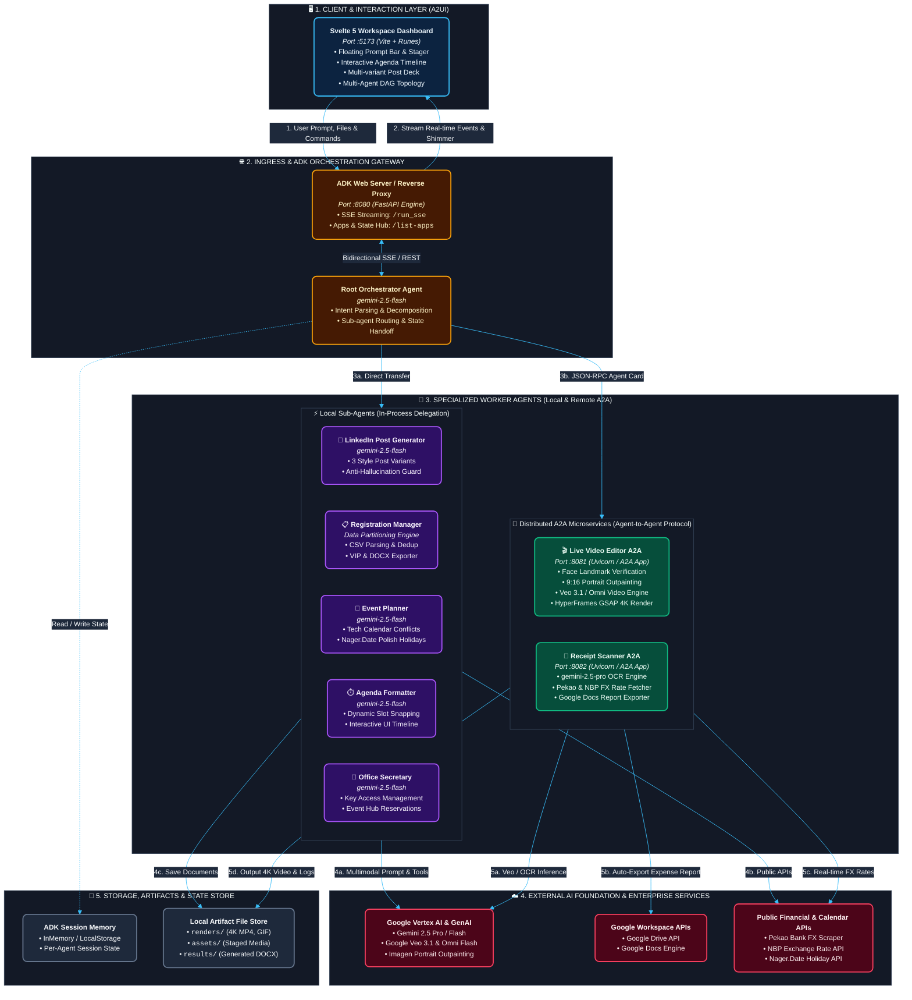

# GDG Agentic Workspace (ADK)

This project is a multi-agent system built on the [Google Agent Development Kit (ADK) 2.0](https://adk.dev/), written in Python. It leverages the capabilities of Vertex AI (Gemini and Veo) models to automate events operations, document templates compilation, receipt scanning, scheduling conflicts analysis, and social media posting.

---

---

## 🏛️ System Architecture



---

## 🏗️ Project Structure

The workspace is organized into a clean, modular hierarchy:

```
gdg_krakow_tool/
├── agents/                       # All Google ADK Agents & sub-agents
│   ├── root_agent/               # Main coordinating Root Agent (gemini-2.5-flash)
│   ├── receipt_scanner/          # Receipt OCR & Google Docs expense report agent (gemini-2.5-pro)
│   ├── video_editor/             # Speaker card outpainting & Veo video generator (Veo + GSAP)
│   ├── linkedin_post_generator/  # LinkedIn announcement & recap post agent
│   ├── registration_manager/     # Registration sorting, capacity & organizers list agent
│   ├── event_planner/            # Tech calendar & holiday clash analyzer agent
│   ├── agenda_generator/         # Event timeline & speaker agenda formatting agent
│   └── office_secretary/         # Office key access & Event Hub reservation agent
│
├── frontend/                     # Custom Svelte 5 + Vite single-page dashboard
│   ├── src/
│   ├── public/
│   └── package.json
│
├── configs/                      # Configuration files (organizers list, API templates)
│   ├── organisers.txt
│   └── organisers.txt.example
│
├── docs/                         # Architecture, guides, and design specifications
│   ├── setup_guide.md
│   └── design.md
│
├── tests/                        # Evaluation datasets & test runners
│   ├── eval/
│   └── test_receipt_scanner.py
│
├── pyproject.toml                # Ruff & Python tools configuration
├── requirements.txt              # Python dependencies
├── setup.py                      # Python package setup
└── package.json                  # Root npm workspace scripts
```

---

## 🧠 ADK Architecture: Session State & Artifacts Management

The multi-agent system leverages core Google Agent Development Kit (ADK) 2.0 primitives:

1. **Model Tiering Strategy**:
   - **`gemini-2.5-pro`** is allocated to complex reasoning & dense document OCR (`receipt_scanner`).
   - **`gemini-2.5-flash`** is deployed across orchestrators and tool-calling agents for fast execution, high concurrency, and zero function-calling errors.
2. **Session State & Data Passing (`session.state`)**:
   - Rather than bloating prompt contexts with raw binary payloads or giant text tables across sub-agent transfers, agents communicate via workspace files and structured session state.
   - Staged media files (`assets/staged_media.mp4`, CSVs, generated posters) are managed per-agent and referenced through local storage paths.
3. **Progressive SSE Streaming**:
   - Real-time Server-Sent Events (`/run_sse`) stream function calls, function responses, and subagent state updates straight into the custom Svelte workspace.

---

---

## 🚀 Quick Start: Launch the Entire Workspace (A2A Architecture)

To spin up the complete distributed multi-agent system (Video Editor A2A on port 8081, Receipt Scanner A2A on port 8082, Root Orchestrator on port 8080, and the Svelte 5 frontend on port 5173), run **a single command**:

```bash
# Start all A2A microservices and frontend concurrently
./start_a2a_workspace.sh
# or
npm start
```

### 🌐 Running Services

* **Frontend UI Dashboard**: [http://localhost:5173](http://localhost:5173)
- **Root Orchestrator Agent**: [http://localhost:8080](http://localhost:8080)
- **Video Editor A2A Service**: [http://localhost:8081/.well-known/agent-card.json](http://localhost:8081/.well-known/agent-card.json)
- **Receipt Scanner A2A Service**: [http://localhost:8082/.well-known/agent-card.json](http://localhost:8082/.well-known/agent-card.json)

---

### Individual Service Commands (Optional)

```bash
# 1. Video Editor A2A Server (Port 8081)
npm run a2a:video

# 2. Receipt Scanner A2A Server (Port 8082)
npm run a2a:receipt

# 3. Root Orchestrator Agent (Port 8080)
npm run a2a:root

# 4. Svelte Frontend (Port 5173)
npm run dev
```

*For detailed setup instructions, including Google Cloud authentication and template folder mapping, check out the [Setup Guide](file:///Users/aplachykau/Experiments/gdg_krakow_tool/docs/setup_guide.md).*

---

## 🎬 Video Editor Agent: Google Veo 3.1 & Gemini Omni Flash

The **Video Editor sub-agent** automates the creation of high-quality, cinematic marketing video intros for event speakers. It combines generative AI models for portrait outpainting and video animation with a deterministic, code-driven GSAP + HTML vector layout engine:

### 🌟 Key Capabilities & Latest Features

1. **Dual Video Generation Engines**:
   - **Google Veo 3.1 (`veo-3.1-fast-generate-001`)**: High-fidelity video generation via Vertex AI with curated cinematic lighting, subtle head motion, and realistic bokeh.
   - **Gemini Omni Flash (`gemini-omni-flash-preview`)**: Fast multimodal Image-to-Video generation via the Google AI Interactions API with unbroken single-shot camera dynamics.
   - Switchable dynamically via `VIDEO_ENGINE=veo` (default) or `VIDEO_ENGINE=omni` in `.env`.

2. **Speaker Portrait 9:16 Outpainting**:
   - Outpaints static photos into vertical 9:16 aspect ratio using Gemini/Imagen, preserving face identity while expanding background context for seamless vertical video framing.

3. **Dynamic Timeline & Adaptive Composition**:
   - **Dynamic Duration Detection**: Probes media with `ffprobe` to automatically adjust the composition timeline between 8s (Veo / Omni video loops) and 10s (custom video uploads).
   - **Adaptive Typewriter Timing**: Dynamically calculates typing speeds and easing curves based on the speaker title character count.
   - **Autoscaling Typography**: Font size dynamically scales to ensure multi-line talk titles fit within design boundaries.

4. **Multi-Format Concurrent Rendering**:
   - **4K Ultra HD MP4** (Upscaled high-bitrate video, `RENDER_4K=true`)
   - **1080p Full HD MP4** (Standard web video, `RENDER_ORDINARY=true`)
   - **Animated GIF** (Optimized for Slack / Discord / email embeds, `RENDER_GIF=true`)
   - **Avatar PNG Snapshots** (Extracted high-res frame for promotional badges)

### ⚙️ Video Generation & Render Configuration (`.env`)

| Variable | Values | Description |
| :--- | :--- | :--- |
| `VIDEO_ENGINE` | `veo` (default) \| `omni` | Selects the video generation model (`veo-3.1-fast-generate-001` or `gemini-omni-flash-preview`). |
| `ENABLE_VIDEO_GENERATION` | `true` \| `false` | Set to `false` for instant layout/text dry-runs using local placeholder assets without consuming video tokens. |
| `RENDER_4K` | `true` (default) \| `false` | Toggles rendering of the 4K Ultra HD MP4 video file. |
| `RENDER_ORDINARY` | `true` \| `false` (default) | Toggles rendering of the 1080p Full HD MP4 video file. |
| `RENDER_GIF` | `true` \| `false` (default) | Toggles automatic GIF conversion via FFmpeg. |

### Developer Commands (From Project Root or inside `agents/video_editor/`)

```bash
# Start local dev server with visual preview (scrub timeline at http://localhost:3000)
npm run video:dev

# Run linter, Chrome validation, and layout checks
npm run video:check

# Render video file
npm run video:render
```

---

## 🧹 Code Quality & Style Formatting (Python)

To keep the codebase clean, ordered, and formatted to a style guide (with a line length limit of **120 characters**), we use **Ruff** — an extremely fast Python linter and formatter configured via `pyproject.toml`.

Make sure your virtual environment is active, then run:

```bash
# Format Python code
ruff format .

# Check for lint errors and warnings
ruff check .

# Apply auto-fixes to check issues
ruff check --fix .
```
