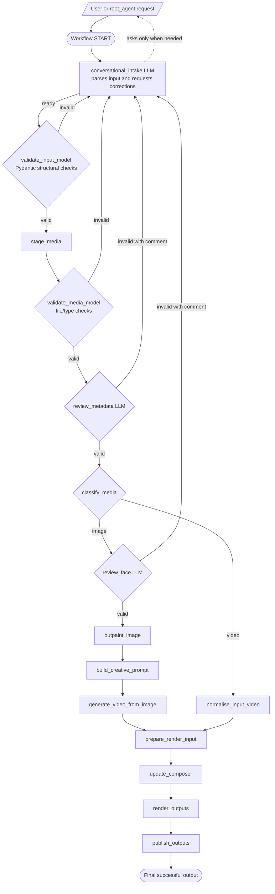

# Video Editor Workflow Pipeline

```mermaid
flowchart TD
    User[/User or root_agent request/]
    Start([Workflow START])
    Intake[conversational_intake LLM<br/>parses input and requests corrections]
    ModelValidation{validate_input_model<br/>Pydantic structural checks}
    Stage[stage_media]
    MediaValidation{validate_media_model<br/>file/type checks}
    MetadataReview{review_metadata LLM}

    User --> Start
    Start --> Intake
    Intake -->|ready| ModelValidation
    ModelValidation -->|invalid| Intake
    ModelValidation -->|valid| Stage
    Stage --> MediaValidation
    MediaValidation -->|invalid| Intake
    MediaValidation -->|valid| MetadataReview
    MetadataReview -->|invalid with comment| Intake
    MetadataReview -->|valid| Classify{classify_media}

    Classify -->|image| VerifyFace{review_face LLM}
    Classify -->|video| NormaliseVideo[normalise_input_video]

    VerifyFace -->|valid| Outpaint[outpaint_image]
    VerifyFace -->|invalid with comment| Intake

    Outpaint --> BuildPrompt[build_creative_prompt]
    BuildPrompt --> GenerateVideo[generate_video_from_image]

    GenerateVideo --> PrepareRender[prepare_render_input]
    NormaliseVideo --> PrepareRender

    PrepareRender --> UpdateComposer[update_composer]
    UpdateComposer --> Render[render_outputs]
    Render --> Publish[publish_outputs]
    Publish --> Success([Final successful output])

    Intake -. asks only when needed .-> User
```
