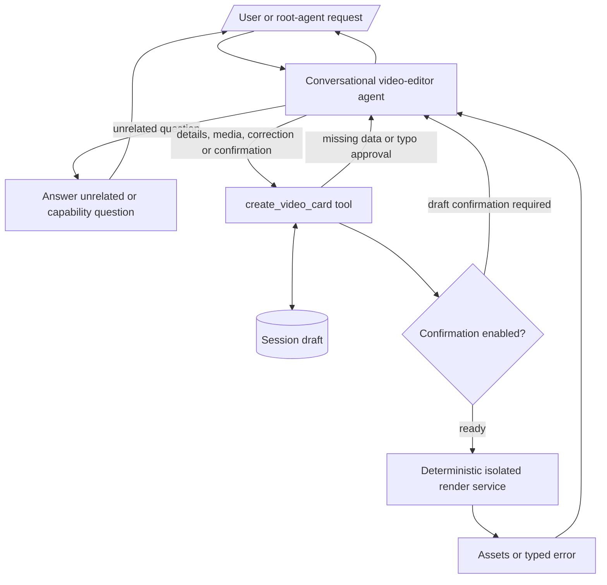

# Video Editor Agent Flow

```mermaid
flowchart TD
    User[/User or root-agent request/]
    Agent[Conversational video-editor agent]
    Help[Answer unrelated or capability question]
    Tool[create_video_card tool]
    Draft[(Session draft)]
    Confirm{Confirmation enabled?}
    Render[Deterministic isolated render service]
    Result[Assets or typed error]

    User --> Agent
    Agent -->|unrelated question| Help
    Help --> User
    Agent -->|details, media, correction or confirmation| Tool
    Tool <--> Draft
    Tool -->|missing data or typo approval| Agent
    Tool --> Confirm
    Confirm -->|draft confirmation required| Agent
    Confirm -->|ready| Render
    Render --> Result
    Result --> Agent
    Agent --> User
```
