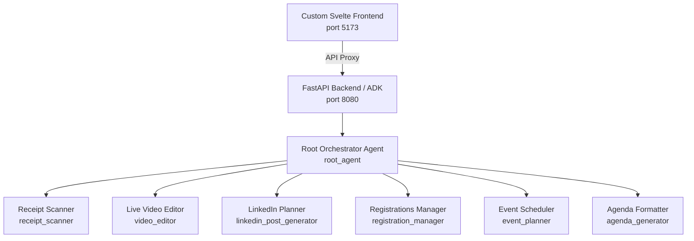

# 🚀 GDG Kraków Tool Suite - Setup & Operations Guide

Welcome to the comprehensive setup and operations guide for the **GDG Kraków Tool Suite**. This project is a multi-agent orchestration workspace built using the [Google Agent Development Kit (ADK) 2.0](https://adk.dev/) in Python (powered by Vertex AI and Gemini models) paired with a high-performance, responsive **Svelte + Vite** custom frontend.

---

## 🏗️ System Architecture

The project consists of three main layers:



1. **Custom Svelte Frontend (`frontend/`)**: A dark-themed, premium workspace that provides a chat interface, real-time status ticker for the agents, and capability highlights.
2. **Root Orchestrator Agent (`root_agent/`)**: The main coordinating Python agent that receives user requests, determines the correct domain, and delegates tasks to the appropriate specialized sub-agents.
3. **Sub-Agents Core**: Six specialized sub-agents covering receipts/expense reporting, speaker video generation, social media management, guest lists, meetup scheduling, and agendas.

---

## 📋 Prerequisites

Ensure you have the following installed on your machine:
* **Python 3.10+** (to run ADK and agent packages)
* **Node.js v22+** (to run the custom Svelte frontend and the HyperFrames render server)
* **FFmpeg** (strongly recommended, used for video rendering and processing tasks)
* **Google Cloud SDK / CLI** (for Vertex AI authentication)

---

## 🛠️ Step-by-Step Setup

Follow these steps to set up both the backend and frontend environments.

### 1. Python Environment (Backend)

Initialize a virtual environment and install backend dependencies in editable mode:

```bash
# 1. Initialize a virtual environment
python3 -m venv .venv

# 2. Activate the environment
source .venv/bin/activate

# 3. Install requirements
pip install -r requirements.txt

# 4. Install the workspace packages in editable mode
pip install -e .
```

### 2. Node.js Environment (Frontend & Video Editor)

Install the Node packages for both the Svelte workspace and the rendering engine:

```bash
# Install Svelte UI dependencies
cd frontend
npm install
cd ..

# Install HyperFrames rendering dependencies
cd video_editor
npm install
cd ..
```

### 3. Google Cloud Authentication

Authenticate your local environment with Google Cloud to grant Vertex AI API access:

```bash
bash <(curl -sSL https://storage.googleapis.com/cloud-samples-data/adc/setup_adc.sh)
```
*Provide your GCP Project ID (e.g., `gdg-agents-496611`) when prompted and complete authentication in your browser.*

### 4. Configuration Settings (.env)

The root agent requires a `.env` file to be present in its directory. Create or update `root_agent/.env` with the following parameters:

```env
# Vertex AI credentials and configuration
GOOGLE_GENAI_USE_VERTEXAI=1
GOOGLE_CLOUD_PROJECT=gdg-agents-496611
GOOGLE_CLOUD_LOCATION=europe-central2
GEMINI_PRO_MODEL=gemini-2.5-pro

# Google Drive and Docs parameters (for receipt scanning & export templates)
GOOGLE_DRIVE_FOLDER_ID=your_drive_folder_id
GOOGLE_DOCS_TEMPLATE_ID=your_docs_template_id

# Video Editor & HyperFrames settings
ENABLE_VIDEO_GENERATION=true
RENDER_ORDINARY=true
RENDER_GIF=true
RENDER_4K=true
```

---

## 🚀 Running the Entire Project

To run the complete system with the custom Svelte frontend talking to the ADK backend agent, you need to spin up two processes in separate terminal sessions:

### Terminal 1: Launch Backend (ADK FastAPI Server)

The backend agent server must run on port `8080` (as Vite is configured to proxy all API requests to `127.0.0.1:8080`).

```bash
# Make sure virtual environment is active
source .venv/bin/activate

# Run the ADK web server mapping all local agents in the current folder
adk web --port 8080 .
```

### Terminal 2: Launch Frontend (Svelte Dev Server)

```bash
cd frontend
npm run dev
```
*This starts the Vite server (typically at `http://localhost:5173`).*

### Open the Application

Now, open your browser and navigate to:
👉 **[http://localhost:5173](http://localhost:5173)**

Here you will find the **Advanced Agentic Workspace** where you can select the active agent, start new chat sessions, type requests, and drag-and-drop receipts or participant rosters directly.

---

## 🛠️ Alternative & Diagnostic Operations

### 1. Using the Default ADK Developer UI
If you want to use the default web playground provided out-of-the-box by ADK:
```bash
source .venv/bin/activate
cd root_agent
adk web --port 8000
```
Open **`http://localhost:8000`** in your browser.

### 2. Testing Receipt Scanner via CLI
You can bypass web servers entirely to test the receipt OCR scanner and currency converter using the CLI:
```bash
source .venv/bin/activate
python receipt_scanner/test_runner.py
```

### 3. HyperFrames Development & Preview Sandbox
To preview the video composition layout, debug GSAP timelines, or check visual spacing:
```bash
cd video_editor

# Run local dev server with hot-reload and visual preview (scrub timeline at http://localhost:3000)
npm run dev

# Run linter, Chrome validation and layout checks
npm run check

# Render composition to an MP4 video file locally
npm run render
```

---

## 🧹 Code Quality & Formatter

Before pushing any Python updates, make sure your code aligns with our Ruff styling guidelines (line-length is capped at `120` characters):

```bash
# Format Python files
ruff format .

# Check for lint errors and warnings
ruff check .

# Apply auto-fixes
ruff check --fix .
```
